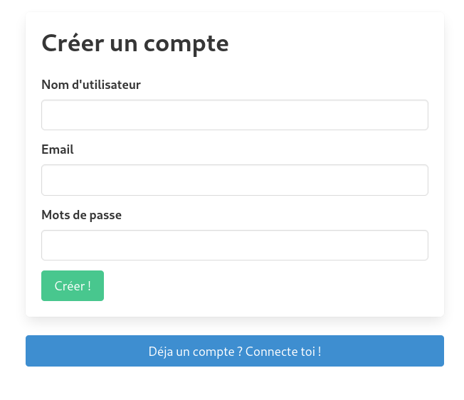

# README

## About this Project

The goal of this project is to create a web application that compares two Wikipedia articles, specifically focusing on the information within the info boxes. Users can input the subjects they want to compare, and the application will provide a detailed comparison of these two entities. It also offers additional information such as the number of words, number of views, etc., to help determine a "winner" between the two articles.

This project is developed by:
- Paul
- Timothé
- Julian

## Principal Features

Key features of the project include:

- A page for comparing two Wikipedia articles.
  

- User authentication and registration.
  
  

- History for connected users.
  

- Admin Panel.
  

## How to Install?

1. Download the entire archive.
2. Open a terminal and install all the Podman composers (if not already installed).
3. Navigate to the project's root folder in a terminal and execute the following commands: `podman-compose build`, `podman-compose up -d`. Alternatively, you can run the "setup.sh" file, ensuring you have the correct permissions: `chmod +x setup.sh`.
4. Open the application by navigating to `localhost:4443/` in your browser.
5. Default admin account credentials:
   - Username: admin
   - Password: admin

## REST API Documentation

### Comparison
- **Endpoint:** `/api/compare?search={Term1},{Term2},{Term3}`
- **HTTP Method:** GET
- **Description:** Compares elements using the `compare` method of the `CompareApiController`.

### User Deletion
- **Endpoint:** `/user/del/{username}/{confirmation}`
- **HTTP Method:** GET
- **Description:** Deletes a user with the specified username based on the provided confirmation.

### User Addition
- **Endpoint:** `/user/new/nom={username}/password={password}`
- **HTTP Method:** GET
- **Description:** Adds a new user with the provided username and password.

### User Role Modification
- **Endpoint:** `/user/role/{username}/{role}`
- **HTTP Method:** GET
- **Description:** Changes the user role for the specified username based on the given role.

# V1 Basic Functionality

- Establishing the project design.
- Setting up a minimal functional architecture with a REST API.
- Enabling communication between container lists: PHP Server, WEB Server, MySQL Database.
- Implementing a slim framework with multiple routes.

# V2 Feature Implementation

### Comparative Display of Wiki Pages
- **Functionality:** Users enter two valid words matching Wikipedia titles to fetch info boxes for comparison.
- **Future Feature:** Implementing automatic word correction to prevent empty info boxes due to syntax errors.

### Search History
- **Description:** Unique to each user, available on the user's dashboard.

### Connection and Data Saving
- Saving data on the client side.

### Application Functionality Improvement
- Implementing HTTPS and developing redundancy, backup.

### Additional Notes (v2)
- **Usage of Comparative Display:** Access `/compare/?search=word1,word2,word3` for JSON formatted infoboxes.
- **HTTPS Implementation:** Completed.
- **Load Balancing:** Under development.

# V3 Feature Implementation

Final version with enhanced features:

+Ease of Deployment
Streamlining setup processes.
Creation of a setup.sh file.

+Intuitive interface for system management and monitoring

+user statistics

+create a user and define their password

+delete users and change ro

+More detailed infoboxes with error returns for empty infoboxes.

+Passwords are hashed using a SHA function.

= (In progress) Strong Fault Tolerance
Load balancing implementation in progress.

= (In progress) Enhances system's fault tolerance and operational smoothness under varying loads.
